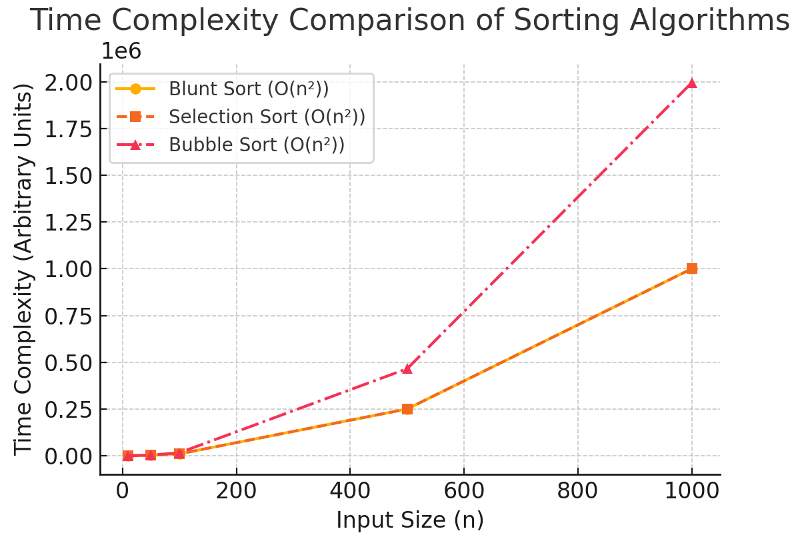

# Blunt Sort – A Novel Selection-Based Sorting Algorithm  

## 📌 Introduction  
Blunt Sort is a **comparison-based sorting algorithm** that sorts elements using a **reverse selection swap approach**.  
Unlike Selection Sort, which finds the **minimum** element and places it in order, Blunt Sort **iteratively selects the maximum element** and pushes it forward.  

🔹 **Sorting Order:** Descending by default  
🔹 **Time Complexity:** O(n²) (similar to Selection Sort)  
🔹 **Space Complexity:** O(1) (in-place sorting)  

### **This repository contains:**  
✅ **Python implementation of Blunt Sort**  
✅ **Research paper explaining its mechanics**  
✅ **Graphical analysis comparing it with Selection and Bubble Sort**  

---  

## 🚀 How It Works  
Blunt Sort operates as follows:  
1. Start from the first element and iterate through the array.  
2. For each position `i`, find the **largest** element in the remaining unsorted part.  
3. Swap it with `nums[i]`, ensuring the largest element moves forward.  
4. Repeat this until the entire array is sorted in **descending order**.  

### 📌 Example Run  
```python
from blunt_sort import blunt_sort

nums = [10, 1, -2, 5, 0, 6, -4, 5]
sorted_nums = blunt_sort(nums)
print(sorted_nums)  # Output: [10, 6, 5, 5, 1, 0, -2, -4]
```  

---  

## 🖥 How to Run the Code  
### 🔹 Option 1: Run Locally  
1. Clone the repository  
   ```bash
   git clone https://github.com/YadhnikaWakde/BluntSort.git
   cd BluntSort
   ```  
2. Run the Python script  
   ```bash
   python blunt_sort.py
   ```  

### 🔹 Option 2: Try it Online (Google Colab)  
- Upload `blunt_sort.py` to **Google Colab** and run the script.  

---  

## 📊 Time Complexity Comparison  
Blunt Sort has a similar **O(n²) complexity** as Selection Sort but performs **more swaps**, making it slightly slower.  

| Algorithm      | Best Case | Worst Case | Space Complexity | Stable? |
|---------------|----------|------------|-----------------|---------|
| **Blunt Sort**  | O(n²)   | O(n²)      | O(1)            | ❌ No |
| **Selection Sort** | O(n²) | O(n²) | O(1) | ❌ No |
| **Bubble Sort** | O(n) | O(n²) | O(1) | ✅ Yes |  

### 📊 Graphical Analysis  
  

---  

## 📄 Research Paper  
For an in-depth analysis of Blunt Sort, read the full **research paper**:  
📄 [Blunt_Sort_Research_Paper.docx](Blunt_Sort_Research_Paper.docx)  

---  

## 📢 Contribute  
Got ideas to optimize Blunt Sort? Feel free to contribute!  
- **Fork this repo**  
- **Submit a pull request**  
- **Improve its efficiency**  

---  

## 📩 Contact  
For queries or collaboration:  
📧 **Email:** your_email@example.com  
🔗 **LinkedIn:** [Your LinkedIn](#)  

---  

🚀 **If you find Blunt Sort interesting, give this repo a ⭐ and share it!**  
